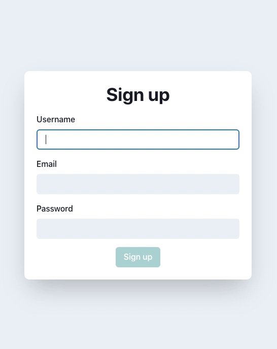

# cocoda-form-example

Cocoda 方式フォームサンプル

- [【フロントエンド初心者向け】ユーザビリティを上げるちょいテク](https://zenn.dev/seya/articles/6e41e4d8c7aa5d)
- https://cocoda.design/signup

using

- [Next.js](https://nextjs.org/)
- [TypeScript](https://www.typescriptlang.org/)
- [Chakra UI](https://chakra-ui.com/)
- [React Hook Form](https://react-hook-form.com/jp/)
- [Zod](https://github.com/colinhacks/zod)
